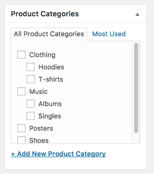

# Product Categories

Product categories are the primary way to group products with similar features. You can also add subcategories if desired.

import Video from '@site/src/components/video'

For example, if you sell clothing, you might have “t-shirts”, “hoodies” and “pants” as categories.

## Creating A Category

Categories are managed from the **Products > Categories** screen.
Similar to categories on your posts in WordPress, you can add, delete, and edit product categories.

- Add a Name.
- Add a Slug (optional); this is the URL-friendly version of the name.
- Choose a Parent if this is a subcategory.
- Enter a Description (optional); some websites display this.
- Upload/Add Image (optional);  Some websites have pages where product category images are displayed, so this is a good idea.

Categories can also be reordered by dragging and dropping – this order is used by default on the front end whenever the categories are listed.

When you add a new product via **Products > Add Product**, you can select this new product category from the list.

Alternatively, you can go to **Products > Add Product** directly, and select **Add New Product Category**. 

## Adding Category To Menu

The below video shows how to create a category and also add it to the menu of your website.

<Video youtubeId='ffGpQ4RHJcM' />