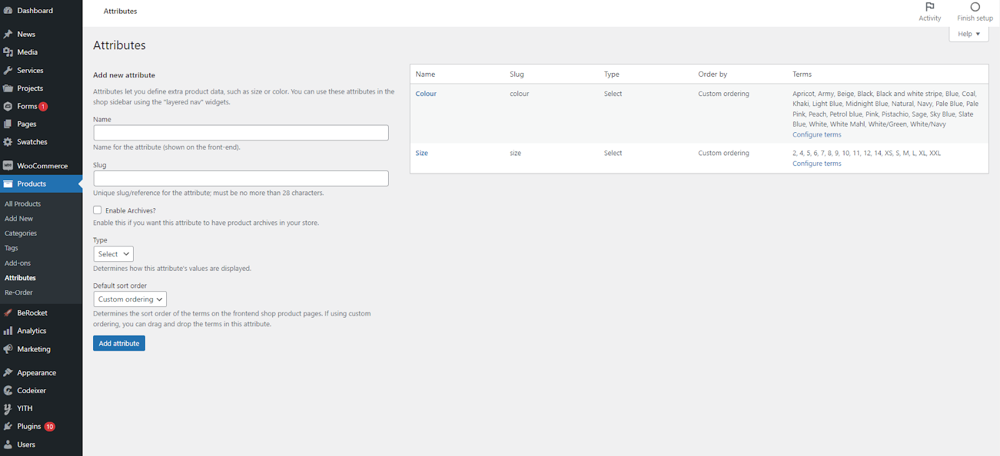
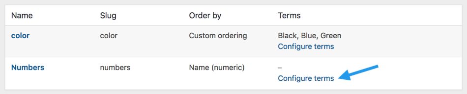

# Product Attributes

To create a variable product, an attribute must first be defined for the product. These attributes can then be used to make a distinction between different variations

import Video from '@site/src/components/video'

For example, if you’re selling clothing, two logical attributes are “color” and “size”, so people can search across categories for a color that fits their style and type and clothing available in their size.

Go to **Products > Attributes** to add, edit, and remove attributes.

Here you can quickly and easily add attributes and their terms.

- Add a Name.
- Add a Slug; (optional); this is the URL-friendly version of the name.

Select **Add Attribute**.

The attribute is added in the table on the right, but without values.

**Select the “Configure terms”** text to add attribute values.

Next **Add New “Attribute name”** on the left hand side, where “Attribute name” automatically takes the name you gave the attribute in the previous step.

Add as many values as you wish. If you selected “Custom ordering” for the attribute, reordering your values can be done here.

<Video youtubeId='Igmgx67T3ss' />