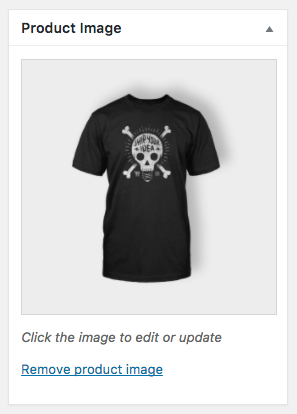

# Adding a Simple Product

A simple product is a product that doesn’t have variations e.g. different colors or sizes. To add a new product click on the products tab. Adding a Simple product is similar to writing a post in WordPress.

1. Go to **WooCommerce > Products > Add Product**. You then have a familiar interface and should immediately feel at home.
2. Enter a product Title and Description.
3. Scroll down to the Product Data panel 

## Product Data

The Product Data box is where the majority of important data is added for your products.

### General Section / Product Price

#### Product Price 

-  Regular Price – Item’s normal/regular price
-  Sale Price – Item’s discounted price that can then be scheduled for certain date ranges. The sale expires at 11:59pm of the specified end date

### Inventory

The inventory section allows you to manage stock for the product individually and define whether to allow backorders and more. It enables you to sell products and allows customers to add them to the cart to buy.
- Enter the **Stock Quantity**, and WooCommerce auto-manages inventory and auto-updates **Stock Status** as Stock, Out of Stock or On Backorder.
- Select whether to **Allow Backorders**.
- **Low stock threshold** – Enter a number upon which you are notified.
- Tick the **Sold Individually box** to limit the product to one per order.

### Shipping Data

- **Weight** – Weight of the item.
- **Dimensions** – Length, width and height for the item.
- **Shipping Class** – Shipping classes are used by certain shipping methods to group similar products.

### Product Short Description

Add an excerpt. This typically appears next to product imagery on the listing page, and the long description appears in the Product Description tab.

## Categories/Tags

See overview of how [Product Categories](../ecommerce/productcategories) work here. On the right-hand side of the Add New Product panel, there are product categories in which you can place your product, similar to a standard WordPress post. You can also assign product tags in the same way

import Video from '@site/src/components/video'

## Product Images

Adding product images and galleries are options available on the right-hand side when adding or editing a product in your store from **WooCommerce > Products**.

The **Product Image** is the main image for your product and is reused in different sizes across your store.

Select **Set Product Image**.

Select an existing image in your Media Library or Upload a new one.

**Remove and Edit** the product image if you’d like to change it, as needed.

Adding, removing and editing a product image is done in the same way as featured images for posts and pages.

## Product Galleries

Create a Product Gallery using the same method as adding a Product Image, but using the Product Gallery meta box.

### Reorder Images

To Reorder images in the product gallery

Images in the product gallery can be re-ordered easily via drag and drop. Simply reorder your images by moving them around.

### Remove Images

To Remove images from the product gallery

To remove an image from the product gallery, hover over the image and click on the red “x.”

