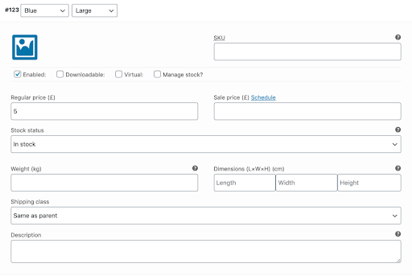

# Adding a Variable Product

Variable products in WooCommerce let you offer a set of variations on a product, with control over prices, stock, image and more for each variation. They can be used for a product like a shirt, where you can offer a large, medium and small and in different colors.

import Video from '@site/src/components/video'

<Video youtubeId='KvUTSmsHCGU' />

***

## Change to A Variable Product Type

To add a variable product, create a new product or edit an existing one.

1. Go to: WooCommerce > Products.
2. Select the Add Product button or Edit an existing product. The Product Data displays.
3. Select Variable product from the Product Data dropdown.

## Add Attributes to Use for Variations

In the Attributes section, add attributes before creating variations — use global attributes that are site-wide or define custom ones specific to a product.

To use a global attribute on your product:

1. First **create** a global [attribute](../ecommerce/attributes).
2. Then you can choose said global attribute from the dropdown and select **Add**.
3. Choose **Select all** to add all values from to the variable product (if applicable).
4. Most importantly select the **Used for variations** checkbox to use these for variations.
5. Select **Save attributes**.

## Add Variations

With attributes created and saved to add a variation, go to the Variations section in the Product data box.

### Manually Add a Variation

1. Select **Add variation** from the dropdown menu, and select **Go**.
2. Select attributes for your variation. To change additional data, click the triangle icon to expand the variation.
3. Edit any available data. The only required field is **Regular Price**.
4. Select **Save changes**.

### Creating All Possible Variations

Select **Create variations from all attributes** to have WooCommerce create every possible combination of variations from your attributes and their values and select **Go**:

It will create a new variation for each and every possible combination of variation attributes (max 50 per run). If you have more possible combinations you can run it again.

For example, if you have two attributes – color (with values blue and green) and size (with values large and small) it creates the following variations:

- Large Blue
- Large Green
- Small Blue
- Small Green

## Adding Variation Data

Each variation can have the following properties.

- Enabled – Enable or disable the variation.
- Virtual – If this product isn’t physical or shipped, shipping settings are removed.
- Regular Price (required) – Set the price for this variation.
- Sale Price (optional) – Set a price for this variation when on sale.
- Stock quantity – Shows if Manage stock? is selected. Allows to set the current stock level for the variation.
- Allow backorders? – Shows if Manage stock? is selected. Allows to set if backorders are allowed for the variation; if enabled, stock can go below zero.
- Low stock threshold – Shows if Manage stock? is selected. When the stock for the variation reaches this level you will get a notification email. If not set, the product-wide threshold will be used (see Inventory Management below).

## Inventory Management

Inventory for variable products can be managed on product and variation levels.

Сhoose how to manage stock by toggling Enable stock management at product level on the Inventory tab:

The following settings are available if you choose to manage stock on a product level:

- SKU – If you use SKUs, set the SKU or leave blank to use the product’s SKU.
- Manage Stock? – Tick the box to manage stock at the variation level.
- Stock Quantity – Shows if Manage Stock is selected. Input the quantity. Stock for the specific variation, or left blank to use the product’s stock settings.
- Allow Backorders – Choose how to handle backorders.
- Low stock threshold – When the stock for the variation reaches this level you will get a notification email.
- Sold Individually? – Allow only one to be sold in one order. (This setting is used for the product itself. You cannot set a specific variation to only be sold once per order)

Choosing to manage stock for variations individually allows you to edit the same properties for each variation.

Set Stock Status can be applied to all variations at once to In stock or Out of stock. Bulk-update under Variations:

## Shipping

Don't forget to add the below if applicable to each variation

- Weight – Weight for the variation, or left blank to use the product’s weight.
- Dimensions – Height, width and length for the variation, or left blank to use the product’s dimensions.

## Add an Image to the Variation

1. Expand the variation.
2. Click the blue image placeholder (screenshot).
3. Select the image you wish to use.
4. Save.

