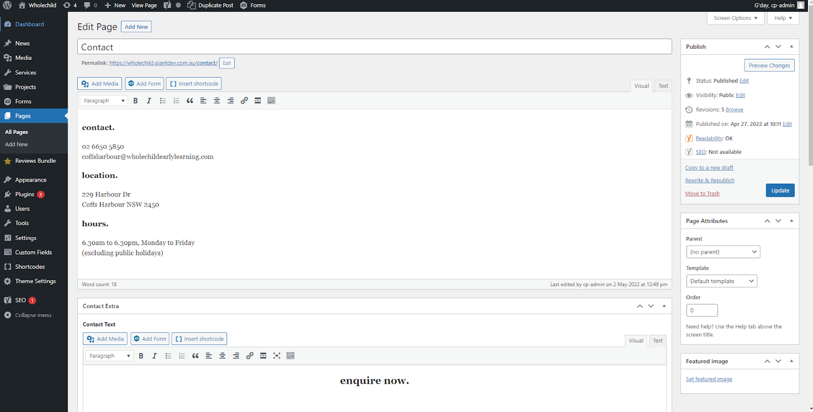

# Editing A Page

<Tabs>
  <TabItem value="Simple Way" label="Simple Way" default>

To edit a page first make sure you logged in and then navigate to the page you wish to change. Once on the page, there is a black bar at the top of the screen click the edit page button

This will take you to another page where there is a text box where you can edit the text on the page and update images etc. Once you're finished hit the update button to update your website.

    
The video below is a quick example of how to edit the phone number on a contact page.

<Video youtubeId='QzBblgYujRY' />

  </TabItem>
  <TabItem value="Alternate Way" label="Alternate Way">
    <Video youtubeId='y9aXC0MeN28' />
  </TabItem>
</Tabs>

import Tabs from '@theme/Tabs';
import TabItem from '@theme/TabItem';
import Video from '@site/src/components/video'