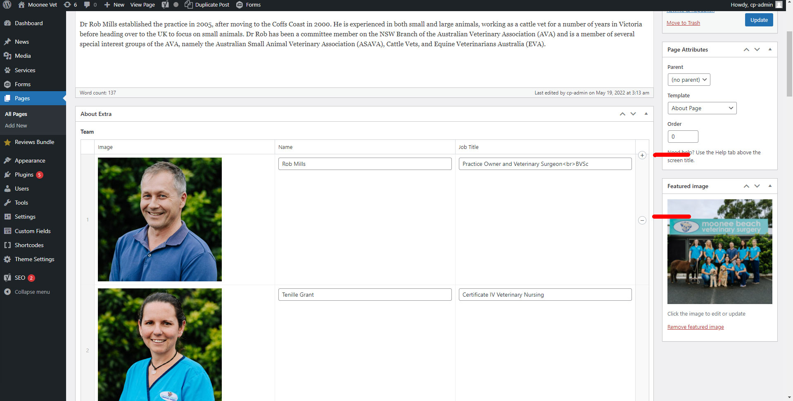

# Staff Sections

To add, update or delete staff members navigate to the page that displays your staff generally this will be on the about page. Click the edit button at the top of the page. Once on this page scroll down until you find where your staff members are.

Once here hover over the box to show the + and - buttons, this will allow you to add and remove staff members. On the left side where the numbers are you can also click and drag the staff to reorder them. Don't forget to hit update when you're done.

import Video from '@site/src/components/video'

<Video youtubeId='hMUYWgsjFp0' />