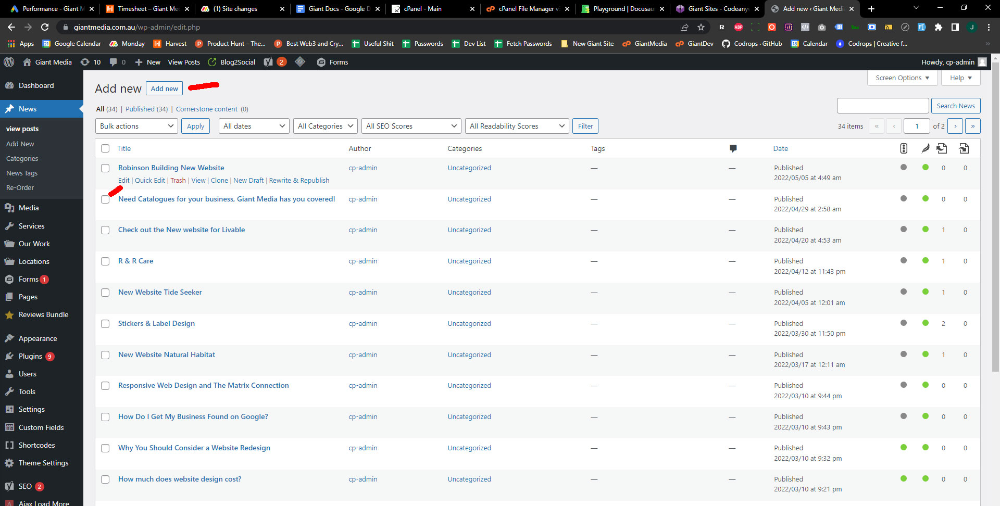

# News/blog items

To add a new News post navigate to the dashboard and click the “News” tab at the top left. 

You will now be on a page with a list of all your posts. Here you can add new, edit or delete posts. The process of editing these pages is the same as in the editing page section

import Video from '@site/src/components/video'

<Video youtubeId='2VaYejq70Is' />
