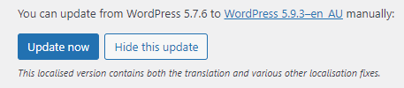

# Updating WordPress

When you log in to your website, you will see a notification like the one below. You can hit the update button and it will take you to another page.

import Video from '@site/src/components/video'

On this page, there will be a blue update now button click this and let your website update before navigation away.

***

<Video youtubeId='hgPzfJ6QJEI' />
